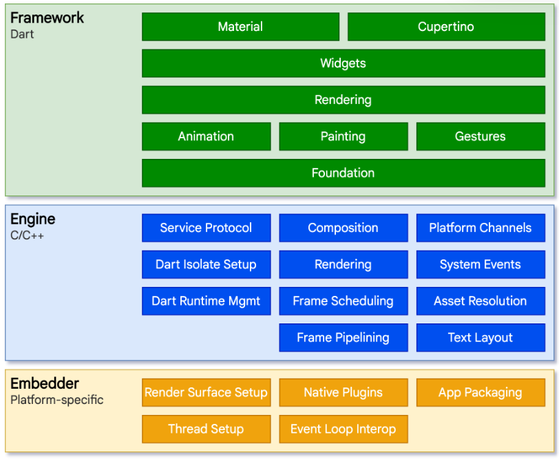

# Flutter Intro
## What is Flutter?
- Google에서 개발한 크로스 플랫폼 개발 프레임워크
- iOS, Android, Windows, MacOS, Linux 등 다양한 플랫폼에 지원됨

## Why Flutter?
### 1. Easy
- Dart를 사용함
- 선언형 UI 구조를 채택 : UI 코드와 로직 코드를 하나의 파일, 하나의 함수 안에서 한 번에 써내려 갈 수 있음
- Widget 단위의 UI 개발 : 조합, 배치가 용이함
### 2. High Productive
- 하나의 코드 베이스로 여러 플랫폼을 동시에 개발할 수 있음
- 객체 지향 프로그래밍 : 만들어진 코드를 재활용하고 수정하는 데 용이함
- 함수형 프로그래밍도 함께 지원함
### 3. Flexible
- 다양한 디스플레이를 지원함
- Mobile, Tablet, Web, Desktop 등 대다수의 디스플레이에 알맞은 레이아웃 제공
- 최근 폴더블과 같은 가변형 디스플레이에 특화된 UI를 구현할 수 있음
### 4. High Performance
- Native에 가까운 성능을 발휘
- UI 코드와 로직 코드를 Native코드로 변환하여 작동하는 것이 아닌 별도의 UI 엔진을 활용하여 효율적으로 구동
- 기존의 SKiA 엔진부터 곧 업데이트 될 Impeller 엔진까지 주기적으로 업데이트가 이루어지고 있음
- 엔진은 C / C++로 이루어져 호환성과 성능을 모두 보장
### 5. Open Source
- 모든 소스가 GitHub에 공개되어있어 누구나 소스코드에 기여할 수 있음
- Google 외에도 수많은 개발자들이 기여하고 있음
### 6. Simple & Beautiful
- Flutter의 기본 UI Widget들은 Material Design을 기반으로 제작됨
- Material 3.0에 대해서도 지원이 이루어지고 있기 때문에 개인화 된 앱에 대한 개발도 가능

## How Flutter Works
### Native Framework
- Swift로 iOS, Java로 Android를 개발
- 운영체제와 직접적으로 연결됨
- 버튼, 텍스트 등 요소를 만들어달라는 요청을 운영체제에 직접 전달함

### Flutter
- Flutter는 실제 iOS, Android 버튼을 만들어내는 기능이 없음
- 다른 크로스플랫폼 프레임워크와 차이가 있음
 

## Flutter 개발을 위한 준비
- DeskTop (iOS 개발을 하려면 Mac 환경 PC 필수)
- Dart
- 테스트 기기 (선택)