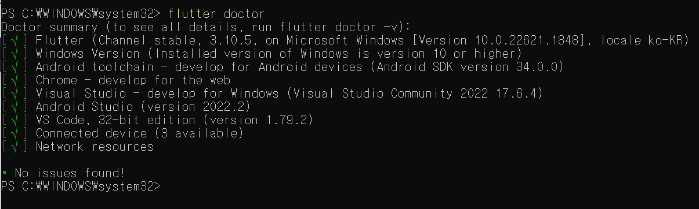
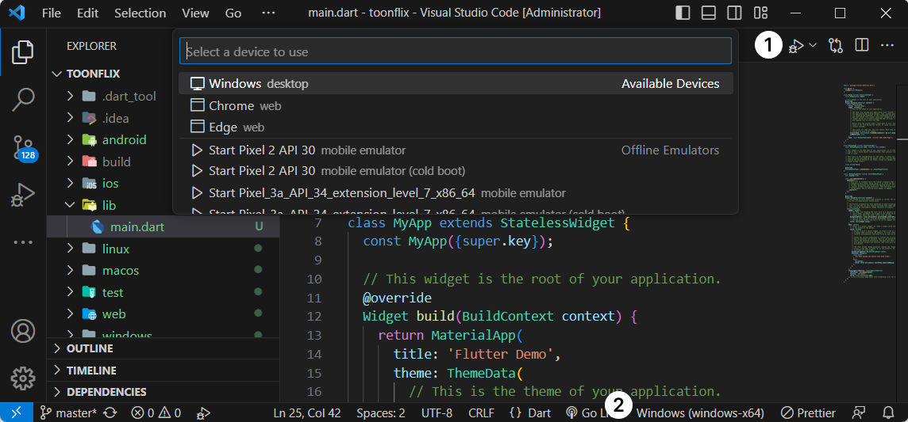
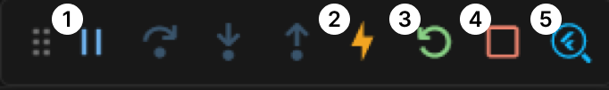
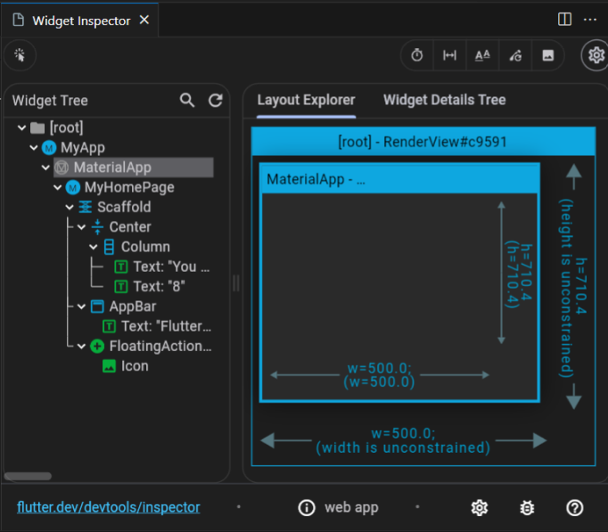

# Flutter Intro
## What is Flutter?
- Google에서 개발한 크로스 플랫폼 개발 프레임워크
- iOS, Android, Windows, MacOS, Linux 등 다양한 플랫폼에 지원됨

## Why Flutter?
### 1. Easy
- Dart를 사용함
- 선언형 UI 구조를 채택 : UI 코드와 로직 코드를 하나의 파일, 하나의 함수 안에서 한 번에 써내려 갈 수 있음
- Widget 단위의 UI 개발 : 조합, 배치가 용이함
### 2. High Productive
- 하나의 코드 베이스로 여러 플랫폼을 동시에 개발할 수 있음
- 객체 지향 프로그래밍 : 만들어진 코드를 재활용하고 수정하는 데 용이함
- 함수형 프로그래밍도 함께 지원함
### 3. Flexible
- 다양한 디스플레이를 지원함
- Mobile, Tablet, Web, Desktop 등 대다수의 디스플레이에 알맞은 레이아웃 제공
- 최근 폴더블과 같은 가변형 디스플레이에 특화된 UI를 구현할 수 있음
### 4. High Performance
- Native에 가까운 성능을 발휘
- UI 코드와 로직 코드를 Native코드로 변환하여 작동하는 것이 아닌 별도의 UI 엔진을 활용하여 효율적으로 구동
- 기존의 SKiA 엔진부터 곧 업데이트 될 Impeller 엔진까지 주기적으로 업데이트가 이루어지고 있음
- 엔진은 C / C++로 이루어져 호환성과 성능을 모두 보장
### 5. Open Source
- 모든 소스가 GitHub에 공개되어있어 누구나 소스코드에 기여할 수 있음
- Google 외에도 수많은 개발자들이 기여하고 있음
### 6. Simple & Beautiful
- Flutter의 기본 UI Widget들은 Material Design을 기반으로 제작됨
- Material 3.0에 대해서도 지원이 이루어지고 있기 때문에 개인화 된 앱에 대한 개발도 가능

## How Flutter Works
### Other Frameworks
- Swift로 iOS, Java로 Android를 개발
- 운영체제와 직접적으로 연결됨
- 버튼, 텍스트 등 요소를 만들어달라는 요청을 운영체제에 직접 전달함

### Flutter
- Flutter는 실제 iOS, Android 버튼을 만들어내는 기능이 없음
- 운영체제와 직접적으로 연결되지 않음
- 엔진이 모든 것을 그려주고, 운영 체제(플랫폼)는 엔진을 돌리는 역할만 수행함
- 게임 엔진과 유사
<br><br>

<br><br>
**Flutter 동작 과정**
1. 엔진을 어플리케이션 내부에 넣음
2. Dart코드를 컴파일함
3. 유저가 앱을 실하면 엔진을 구동하는 runner 프로젝트(embedder)를 실행
4. 엔진이 모든 UI를 프레임워크와 함께 그려줌
<br><br>
**Flutter의 단점 : 네이티브 위젯을 사용하지 않음**
- 모든 위젯은 운영체제에 의해 그려지는 것이 아닌 오로지 렌더링 엔진에 의해서만 그려짐
- 플러터에서 유사한 디자인을 제공하지만 100% 같은 것은 아님
- 하지만 그만큼 제약이 없다는 의미

## Flutter vs React Native
### React Native
- 네이티브 앱 운영체제에서 제공하는 위젯을 사용하고 싶을 때
- ex) React Native에서 버튼을 만들면 > Android, iOS에서 다르게 보임

### Flutter
- 세밀한 디자인 요구사항이 있을 때
- 요소, 애니메이션 등을 모두 커스터마이징 해야할 때
- Android, iOS와 유사하게 만드는 것이 목표가 아닐 때
- ex) 커스텀 슬라이드를 만들 때, React Native보다 훨씬 적은 시간이 소요됨

## Installation (for Windows)
**모든 코드 작업은 관리자 권한으로 실행 (PowerShell, VSCode)**
### 1. Flutter SDK 설치
<b>방법 1 : .zip파일 다운로드하기 (공식 홈페이지)</b>
- [공식 홈페이지 설치 가이드](https://docs.flutter.dev/get-started/install/windows)
<b>방법 2 : Chocolatey로 설치하기 (추천)</b>
- [Chocolatey 설치](https://chocolatey.org/install)
1. PowerShell 관리자 권한으로 열기
2. `Get-ExecutionPolicy` 명령어 입력
3. `Restricted`일 경우 `Set-ExecutionPolicy AllSigned` or `Set-ExecutionPolicy Bypass -Scope Process` 입력
4. 다음 코드 입력하면 Chocolatey 설치 완료
```
Set-ExecutionPolicy Bypass -Scope Process -Force; [System.Net.ServicePointManager]::SecurityProtocol = [System.Net.ServicePointManager]::SecurityProtocol -bor 3072; iex ((New-Object System.Net.WebClient).DownloadString('https://community.chocolatey.org/install.ps1'))
```
5. `choco install flutter` 입력하면 Flutter 설치 완료
- 만약 오류 발생 시 Chocolatey 버전 업그레이드 : `choco upgrade chocolatey`

### 2. 시뮬레이터 설치 및 설정
- [Android Studio](https://docs.flutter.dev/get-started/install/windows#android-setup)
- Android Studio 설치 및 USB 디버깅(선택), Android Licenses, Visual Studio 설치 등 순서대로 진행

### 3. Flutter doctor
- 위 과정을 모두 진행한 후 현재 설치된 Flutter 환경에서 에러 사항이 있는지 체크하는 명령어
- PowerShell에서 `flutter doctor` 입력하면 다음과 같이 체크 사항이 뜸

<h4>오류 및 해결방법</h4>

1. Flutter - Dart 오류

    ```
    ! Warning: `dart` on your path resolves to C:\tools\dart-sdk\bin\dart.exe, which is not inside your current Flutter SDK checkout at C:\tools\flutter. Consider adding C:\tools\flutter\bin to the front of your path.
    ```
- 원인
    - 시스템이 현재 다른 위치의 Dart를 사용하려고 함
    - 컴퓨터의 PATH 환경 변수에서 dart 명령어가 현재 Flutter SDK가 아닌 다른 위치를 가리키고 있음
- 해결 방법
    - `C:\tools\flutter\bin`을 PATH 환경 변수의 맨 앞에 추가
    - 맨 앞에 추가하면 해당 경로를 가장 우선적으로 탐색함

2. Android toolcain

    ```
    [!] Android toolchain - develop for Android devices (Android SDK version 34.0.0)
    X cmdline-tools component is missing
      Run `path/to/sdkmanager --install "cmdline-tools;latest"`
      See https://developer.android.com/studio/command-line for more details.
    X Android license status unknown.
      Run `flutter doctor --android-licenses` to accept the SDK licenses.
      See https://flutter.dev/docs/get-started/install/windows#android-setup for more details
    ```
- 원인
    - cmdline-tools component가 설치되지 않음
    - Android SDK license가 수락되지 않음
- 해결 방법
    - cmdline-tools 설치 후 `flutter doctor --android-licenses` 실행
    - cmdline-tools는 Android Studio의 SDK Manager > SDK Tools에서도 설치할 수 있음

### 4. Create Flutter Project
- 두 방법 모두 반드시 **관리자 권한으로 실행해야 함**

**방법 1 : PowerShell**
1. `cd [프로젝트를 생성할 경로]`로 폴더 이동
2. `flutter create [프로젝트 이름]`으로 프로젝트 생성
3. `cd [프로젝트 이름]`으로 폴더 이동 후, `code .`으로 VSCode 실행 

**방법 2 : VSCode**
1. Termainal에서 `flutter create [프로젝트 이름]`으로 프로젝트 생성
2. `cd [프로젝트 이름]`으로 폴더 이동

## Visual Studio Code for Flutter
### Extensions
- Dart, Flutter Extension 설치 필수
- Flutter 개발에 필요한 다양한 Interface를 제공함
<br>



### Run Flutter App (Debugging)
!
1. Pause : 디버깅 일시 정지
2. Hot Reload : 앱을 재로딩하며 기존 State는 유지
    - Widget Tree만 재구성하고 main() 및 initState()는 다시 호출되지 않음
3. Restart : 앱을 새로 시작하며 기존 State를 잃음
4. Stop : 디버깅 중지
5. Widget Inspector : Widget Tree와 Layout Expolorer 제공
<br><br>


## Flutter App Basic Codes
- 기초 파일 : lib 폴더 안의 `main.dart`
- 모든 코드 지우고 다음 상태에서 시작
```dart
import 'package:flutter/material.dart';

void main() {
  runApp(App());
}
```
- runApp은 `import 'package:flutter/material.dart';`에서 받아온 함수
- 마우스를 올려보면 인자로 Widget이 필요함을 알 수 있음

### Widget
- 화면을 구성하는 요소
- Widget은 class로 이루어져 있음

### StatelessWidget
- 상태(state)가 없기 때문에 상태를 관리할 필요가 없는 Widget
```dart
...

class App extends StatelessWidget {
    @override
    Widget build(BuildContext context) {
        return MateralApp(
            ...
        )
    }
}
```
- StatelessWidget를 상속받기 위해서는 build 메소드를 구현해야 함
- build : return하는 Widget을 화면에 띄워주는 함수
- App이 root Widget이기 때문에 return값을 두 가지 중 하나로 정해야 함
    1. MaterialApp(구글 디자인 시스템)
    2. CupertinoApp(애플 디자인 시스템)

### Using Widgets
```dart
...
class App extends StatelessWidget {
  @override
  Widget build(BuildContext context) {
    return MaterialApp(
      home: Scaffold(
        appBar: AppBar(
          title: Text("Hello Flutter!"),
          elevation: 10,
        ),
        body: Center(child: Text("Hello world!")),
      ),
    );
  }
}
```
- Widget의 인자로 Widget이 들어감
- 각 Widget(class)에 마우스를 올리면 어떤 값을 넣어야 할 지 알 수 있음
    - Scaffold : Widget을 정렬함
    - AppBar : 앱 상단바를 만들어 줌
- class가 끝날 때마다 comma(,)를 찍어주면 VSCode에서 자동으로 주석을 달아줌